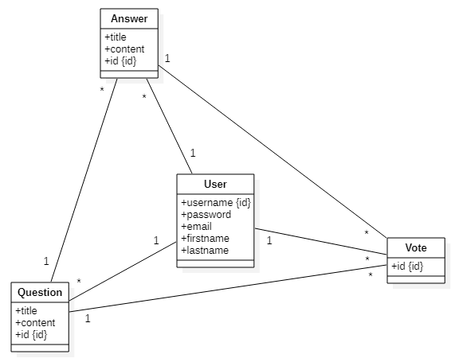

<h1 align="center">AMT : Project 1 - Overflow</h1>
<h3 align="center">Gil Balsiger, Chris Barros, Julien Béguin & Gaëtan Daubresse</h3>

  
  
  
  

## Specifications

### Pages

| Name                             | Path                      | Access                |
| ---------------------------------| ------------------------- | ----------------------|
| Home page                        | `/`                       | Tout le monde         |
| Inscription / Connexion          | `/login`                  | Tout le monde         |
| Liste des questions              | `/questions`              | Tout le monde         |
| Page d'une question              | `/questions/<question id>`| Utilisateurs connectés|
| Nouveau commentaire              | `/comment/<content_id>`   | Utilisateurs connectés|
| Profil                           | `/profile/<user id>`      | Utilisateurs connectés|
| Changement du mot de passe       | `/changePassword`         | Utilisateurs connectés|

#### Page d'accueil
Contient un bouton qui donne accès à la liste des questions postées.

#### Page de connexion/inscription
Contient deux formulaires : un permettant la création d'un compte utilisateur, et un autre pour se connecter.

#### Page de la liste des questions
Contient la liste des questions qui ont été postées. Il est possible de chercher une question à l'aide de la barre de 
recherche selon son contenu ou son auteur. Il est possible de cliquer sur le titre d'une question pour accéder à son
contenu et lire les commentaires et les réponses associés. 
À gauche de la page, il y a un champ de texte qui permet de poster une question.

#### Page d'une question
On peut lire la question posée ainsi que tous les commentaires qui lui sont associés. Il suit ensuite la liste des réponses liées
à cette question ainsi que leurs commentaires respectifs.
Il est possible de voter pour tout contenu en cliquant sur les boutons + ou - pour respectivement upvote ou downvote.
Tout en bas de la page, il y a un champ de texte qui permet d'écrire une réponse à la question.

#### Nouveau commentaire
Contient un champ de texte qui permet l'ajout d'un commentaire à un contenu. Lorsque le commentaire est soumis, on est 
redirigé ensuite sur la page de la question.

#### Profil
Page qui contient des informations de l'utilisateur et un bouton permettant le changement du mot de passe.

#### Page du changement de mot de passe
Un formulaire qui demande l'ancien mot de passe utilisateur, le nouveau qui sera utilisé. 

### Politique de vote

- Un utilisateur peut voter pour:
    - Une question
    - Une réponse
    - Un commentaire
- Ces votes sont soit des upvotes, soit des downvotes
- Un contenu a un score de points et change selon si l'utilisateurs upvote ou downvote
- Un contenu ne peut pas être à la fois upvote ou downvote
- Rappuyer sur le bouton d'upvote alors que l'on avait déjà upvote annule ce upvote. Pareil pour le downvote 

### Database

## Installation

1. Clone le repo
2. Lancer une nouvelle terminal session dans le dossier fraîchement cloné  
3. Lancer la commande `docker-compose up`
4. Aller à l'adresse http://localhost:9080/overflow-1.0-SNAPSHOT

> À noter: Il est aussi possible d'obtenir une image Docker de l'application via le Github Repository en utilisant la
> commande suivante: 
>
> `docker pull ghcr.io/amt-los-pollos-hermanos/overflow:latest`
>
> À ce moment, il n'est pas nécessaire de lancer l'application via docker-compose, mais seulement la base de données avec la 
>commande : 
>
>`docker-compose up -d db`   

<!--
First you need to pull the image from GitHub Packages. The package is public, so you only need to copy the command of the [overflow package](https://github.com/orgs/AMT-Los-Pollos-Hermanos/packages/container/package/overflow). 

Then when the pull is finished, you need to run this command: `docker run -p 9080:9080 <image_id>`. The id of the image can be found using `docker images`.

Finally, to connect to the web-app, you need to connect to: http://localhost:9080/overflow-1.0-SNAPSHOT/login
-->

### JMeter

##### Création du test JMeter 

- Ouvrir JMeter 
- Aller dans File > Open et choisir le fichier overflow_test1.jmx situé dans le répértoire jmeter de notre projet 
- Cliquer sur Start  
- Les résultats sont visibles dans la section View Results Tree

