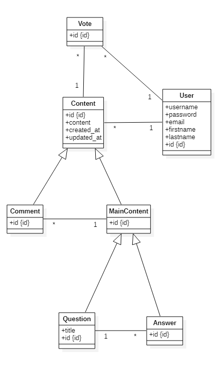

<h1 align="center">AMT : Project 1 - Overflow</h1>
<h3 align="center">Gil Balsiger, Chirs Barros, Julien Béguin & Gaëtan Daubresse</h3>

  
  
  

## Specifications

### Pages

| Name                           | Path                      | Access          |
| ------------------------------ | ------------------------- | --------------- |
| List of questions (pagination) | `/` or `/questions`       | Everyone        |
| Question page (pagination)     | `/question/<question id>` | Everyone        |
| Register / Login               | `/login` and `/register`  | Everyone        |
| New question                   | `/new-question`           | Connected Users |
| Profile                        | `/profile/<user id>`      | Connected Users |

### Question page feature

| Name                                  | Access          |
| ------------------------------------- | --------------- |
| List answer and comments              | Everyone        |
| Provide answer                        | Connected Users |
| Add comments (to question or answer)  | Connected Users |
| Vote (to question, answer or comment) | Connected Users |

### Page layout

**Header** : Search bar

**Content** : Page's content

**Footer** : statistics (number of registered users, number of questions, etc.)

### Password policy

[To define]

### Vote policy

[To define]

### Database

## Installation

1. Clone the repo
2. Start a new terminal session in the folder of the freshly cloned repo
3. Run `docker-compose up`
4. Go to http://localhost:9080/overflow-1.0-SNAPSHOT

<!--
First you need to pull the image from GitHub Packages. The package is public, so you only need to copy the command of the [overflow package](https://github.com/orgs/AMT-Los-Pollos-Hermanos/packages/container/package/overflow). 

Then when the pull is finished, you need to run this command: `docker run -p 9080:9080 <image_id>`. The id of the image can be found using `docker images`.

Finally, to connect to the web-app, you need to connect to: http://localhost:9080/overflow-1.0-SNAPSHOT/login
-->

### JMeter

##### Création du test JMeter 

- Ouvrir JMeter 
- Aller dans File > Open et choisir le fichier overflow_test1.jmx situé dans le répértoire jmeter de notre projet 
- Cliquer sur Start  
- Les résultats sont visibles dans la section View Results Tree

